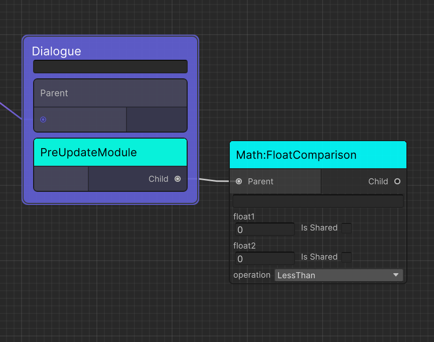
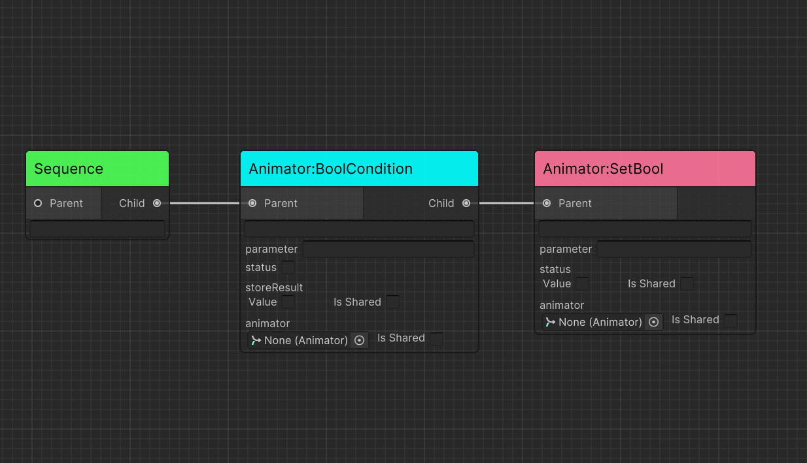
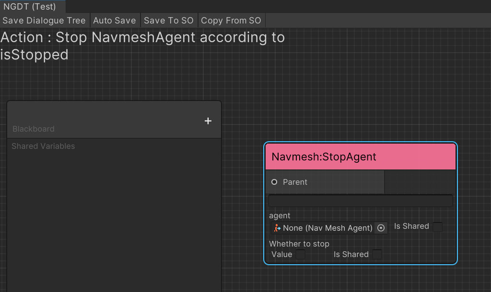
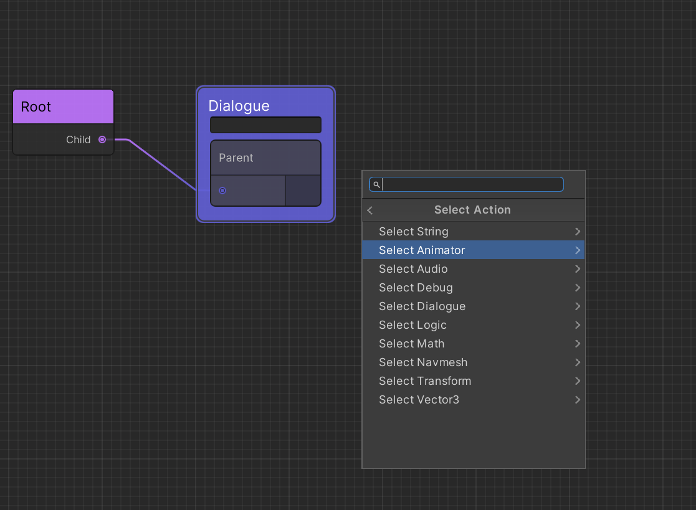
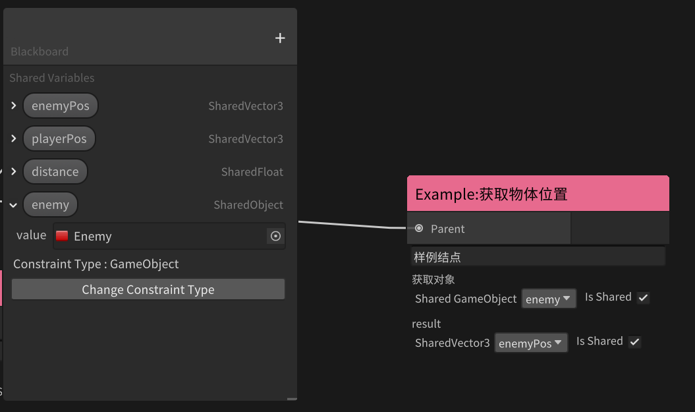

# API
  - [Container Node](#container-node)
    - [Dialogue](#dialogue)
    - [Piece](#piece)
    - [Option](#option)
  - [Built In Composite Node](#built-in-composite-node)
    - [Sequence](#sequence)
    - [Selector](#selector)
    - [Parallel](#parallel)
    - [Random](#random)
    - [Rotator](#rotator)
  - [Create New Behaviors](#create-new-behaviors)
    - [Create Action](#create-action)
    - [Create Conditional](#create-conditional)
    - [Create Composite](#create-composite)
    - [Create Decorator](#create-decorator)
  - [Create New Modules](#create-new-modules)
    - [Create Custom Module Data (For Dialogue System)](#create-custom-module-data-for-dialogue-system)
    - [Create Custom Module Behavior (For Dialogue Tree)](#create-custom-module-behavior-for-dialogue-tree)
  - [Create Resolvers](#create-resolvers)
  - [Attributes](#attributes)
  - [SharedVariable](#sharedvariable)


## Container Node

### Dialogue
* Contains dialogue basic module such as define specific resolver
* Contains a ``Piece`` sequence to select next if previous one fails 

### Piece
* Contains dialogue piece
* If has ``Conditional Module`` and return ``Status.Fail``, piece will be discard and parent ```Dialogue```  will try to find next piece if in its children sequence
* Contains a ``Option`` sequence to select next if previous one fails 
  
### Option
* Contains dialogue option
* If has ``Conditional Module`` and return ``Status.Fail``, piece will be discard and parent ```Piece```  will try to find next option if in its children sequence


## Built In Composite Node

### Sequence
* Updates the child nodes in order from the top. 
* Returns failure immediately if the child node returns failure. 
* Returns success if all child nodes return success.  

### Selector
* Updates the child nodes in order from the top. 
* Returns success immediately if the child node returns success. 
* Returns failure if all child nodes return failure.  

### Parallel
* Updates all child nodes.
* Returns failure if any child node returns failure.
* Otherwise, returns success.

### Random
* The child nodes are elected and executed according to the probability based on the uniform distribution.  
* Select one for each update. 

### Rotator
* Updates the child nodes in order. Unlike Sequence, one child node is executed by one update instead of executing all child nodes by one update.  
* For example, if there are three child nodes, the first Update will execute the top node, the next Update will execute the second node, and the next Update will execute the third node.  
* The next run will run the top node again.  

## Create New Behaviors

### Create Action
* Create C# Script and extends `Action`
* Override `OnUpdate` and return status(Success/Failure).
* Override `Awake` called by `Awake` if needed.
* Override `Start` called by `Start` if needed.

```c#
public class LogAction : Action
{
    [SerializeField] 
    private float logText;

    protected override Status OnUpdate()
    {
        Debug.Log(logText);
        return Status.Success;
    }
}
```

### Create Conditional
* Create C# Script and extends `Conditional`
* Override `IsUpdatable` and return result(true/false). when `IsUpdatable` returns update child.
* Override `OnAwake` called by `Awake` if needed.
* Override `OnStart` called by `Start` if needed.

```c#
public class IsHateGt: Conditional
{
    [SerializeField] 
    private int threshold;

    private Enemy enemy;

    protected override void OnAwake()
    {
        enemy = gameObject.GetComponent<Enemy>();
    }

    protected override bool IsUpdatable()
    {
        return enemy.Hate > threshold;
    }
}
```

* Conditional Node can be leaf node like Action Node.


* Conditional Node can be branch node.



### Create Composite
* Create C# Script and extends `Composite`
* Override `OnUpdate` and return status(Success/Failure).
* Override `OnAwake` called by `Awake` if needed.
* Override `OnStart` called by `Start` if needed.

```c#
 [AkiInfo("Composite : Random, random update a child and reselect the next node")]
public class Random : Composite
{
    protected override Status OnUpdate()
    {
        var result = UnityEngine.Random.Range(0, Children.Count);
        var target = Children[result];
        return target.Update();
    }
}
```

### Create Decorator
* Decorator node is used to modify the return value and reduce the number of Conditional or Composite nodes used
* Create C# Script and extends `Decorator`
* Override `OnDecorate(Status childStatus)` to modify the return value according to the return value of the child node.
* Decorator inherits the `CanUpdate` of the child node, that is, if the child node is Conditional, the node will inherit its judgment value. If you want to modify `CanUpdate`, you can override `OnDecorate(bool childCanUpdate)`
* Override `OnAwake` called by `Awake` if needed.
* Override `OnStart` called by `Start` if needed.

```c#
[AkiInfo("Decorator : If the child node returns Success, it is reversed to Failure," +
    " if it is Failure, it is reversed to Success.")]
[AkiLabel("Invertor")]
public class Invertor : Decorator
{
    protected override Status OnDecorate(Status childeStatus)
    {
        if(childStatus==Status.Success)
            return Status.Failure;
        else
            return Status.Success;
    }
}
```

## Create New Modules

### Create Custom Module Data (For Dialogue System)

* Create C# Script, uses struct type (which is preferred) and extends `IDialogueModule`, this struct is displayed as a runtime module that will be resolved by Resolvers during dialogue tree running
* (Optional) Extend `IApplyable` and override `Apply(DialogueNode parentNode)` to let this module to modify parent's base property such as container's content when container builds

```C#
public readonly struct VITSModule : IDialogueModule
{
    private readonly int characterID;
    public int CharacterID => characterID;
    public VITSModule(int characterID)
    {
        this.characterID = characterID;
    }
}
```

### Create Custom Module Behavior (For Dialogue Tree)

Custom Module Behavior roles as a bridge to add your own modules to dialogueTree's container
* Create C# Script and extends `CustomModule`
* Override `IDialogueModule GetModule` and return your customized module.

```C#
[AkiInfo("Module : Localized Content Module is used to modify dialogue content such as piece and option using Unity.Localization.")]
[ModuleOf(typeof(Piece))]
[ModuleOf(typeof(Option))]
public class LocalizedContentModule : CustomModule
{
    [SerializeField]
    private SharedString tableEntry;
    [SerializeField]
    private SharedString stringEntry;
    protected sealed override IDialogueModule GetModule()
    {
        return new NGDS.ContentModule(new LocalizedString(tableEntry.Value, stringEntry.Value).GetLocalizedString());
    }
}
```

## Create Resolvers

Use Resolvers to let dialogue system to resolve containers when they are running instead of building, such as translation or any async method can be await before content actually to be displayed
* Extends `IDialogueResolver` to handle dialogue logic, example can be found in ``BuiltInDialogueResolver``
* Extends `IPieceResolver` to handle piece logic, example can be found in ``BuiltInPieceResolver``
* Extends `IOptionResolver` to handle option logic, example can be found in ``BuiltInOptionResolver``

## Attributes

1. You can use ``AkiInfo`` attribute to describe the behavior detail of the node for information.
```C#
[AkiInfo("Action : Stop NavmeshAgent according to isStopped")]
public class NavmeshStopAgent : Action
{
    
}
```

1. ``AkiLabel`` attribute is added for replacing label of node's title or field especially for Chinese.
   
```C#
[AkiLabel("Navmesh : SetDestination")]
public class NavmeshSetDestination : Action
{
    [SerializeField, Tooltip("If not filled in, it will be obtained from the bound gameObject")]
    private SharedTObject<NavMeshAgent> agent;
    [SerializeField]
    private SharedVector3 destination;
}
```


3. ``AkiGroup`` is an advanced attribute using in Node Searching,you can add this attribute to make it easier and more clear to find certain node.

```c#
[AkiGroup("Animator")]
public class AnimatorSetBool : AnimatorAction
{
    
}
```



   * You can also subcategory the SearchWindow by using ``'/'``.

4. ``ForceShared`` is used to force SharedVariable to shared mode, you cannot edit its local value in Editor.

## SharedVariable

1. The use of shared variables needs to be initialized in Awake to bind the variables in the parent behavior tree.
```C#
public class GetGameObjectPosition : Action
{
    [SerializeField]
    private SharedTObject<GameObject> target;
    [SerializeField]
    private SharedVector3 result;
    public override void Awake()
    {
        InitVariable(target);
        InitVariable(result);
    }
    protected override Status OnUpdate()
    {
        if (target.Value != null) result.Value = target.Value.transform.position;
        return Status.Success;
    }
}
```

1. In addition to value types, you can use ``SharedObject`` to share any object that inherits from ``UnityEngine.Object``. If you want to limit the type you can use ``SharedTObject<T>`` so that in the drop-down bar in the editor you will only be able to reference SharedObjects with the same type
2. In the blackboard, you can create a ``SharedObject`` and restrict its type to improve type safety and make the field only drag and drop objects of the corresponding type.


