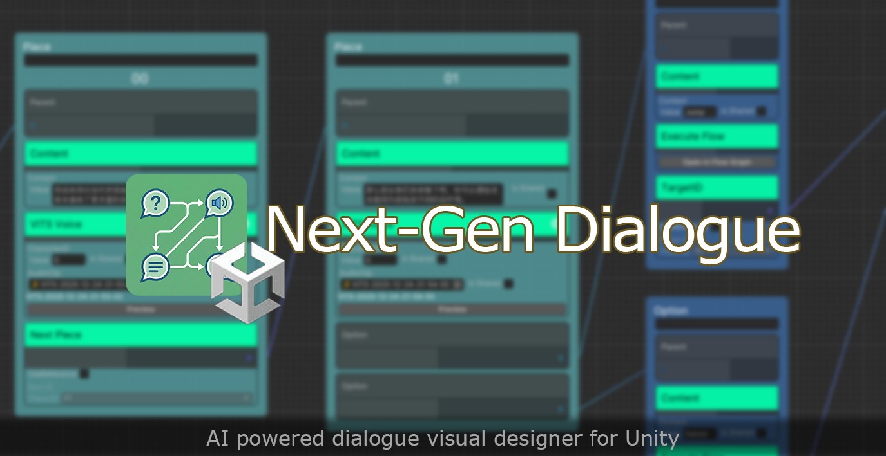
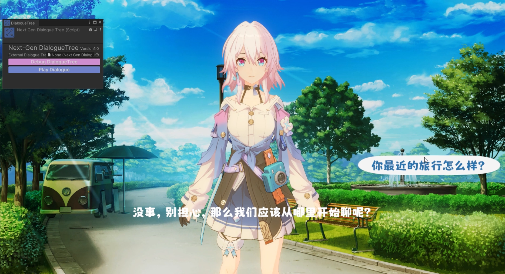
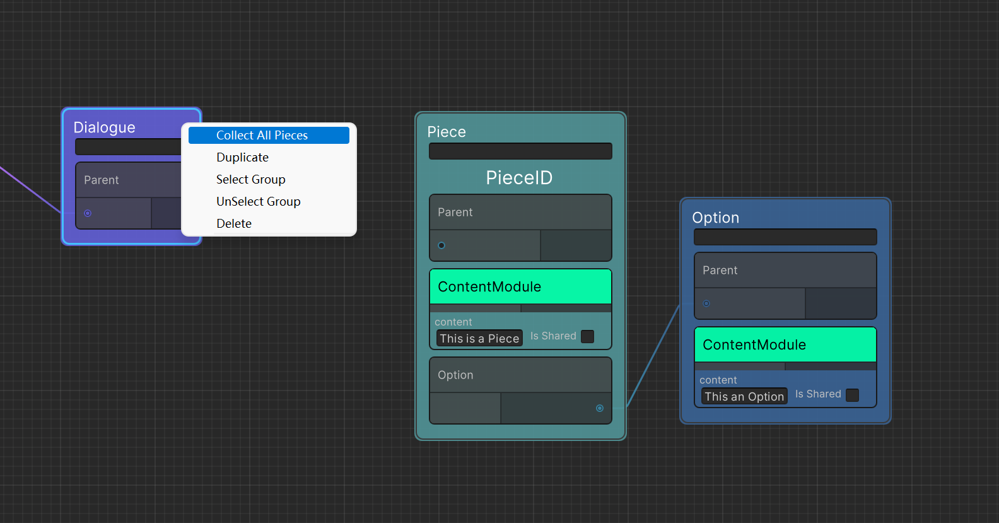
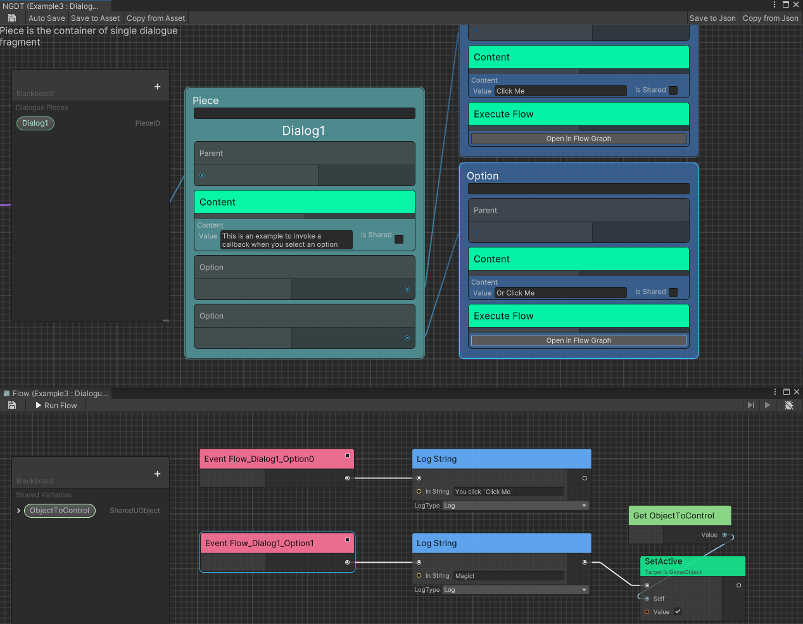
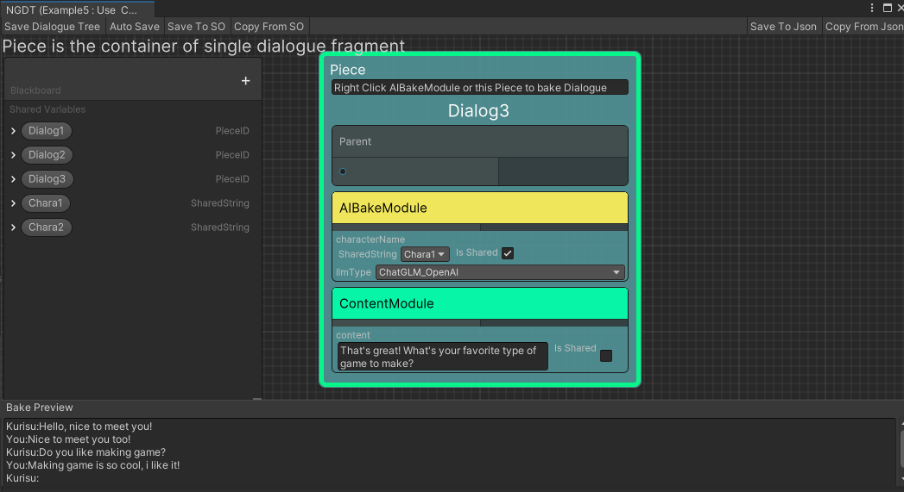
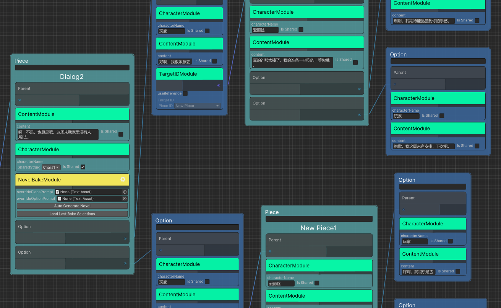
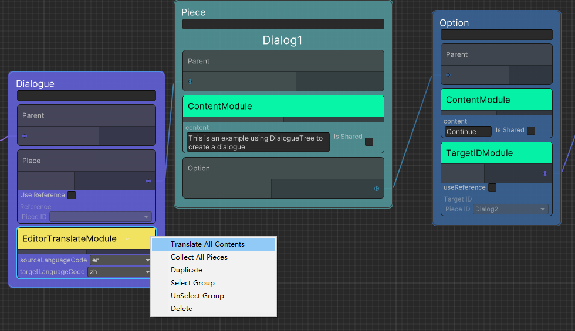
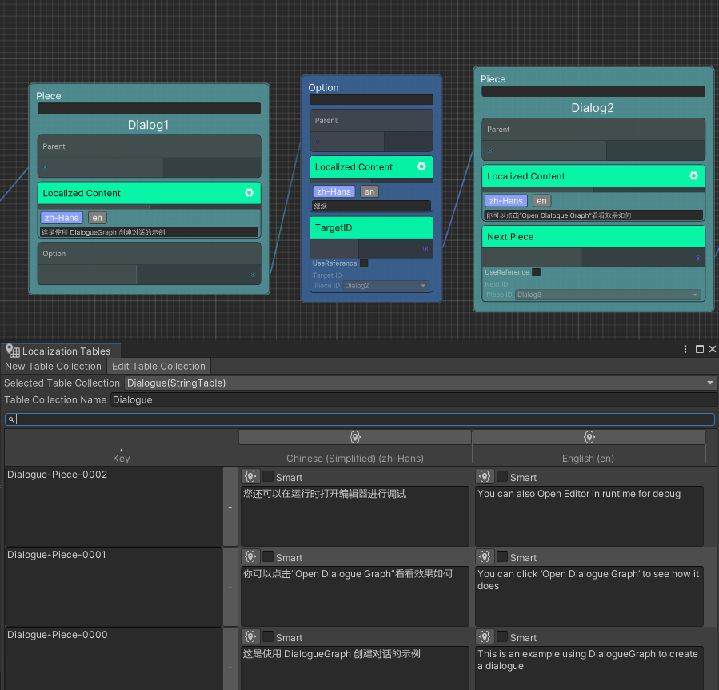
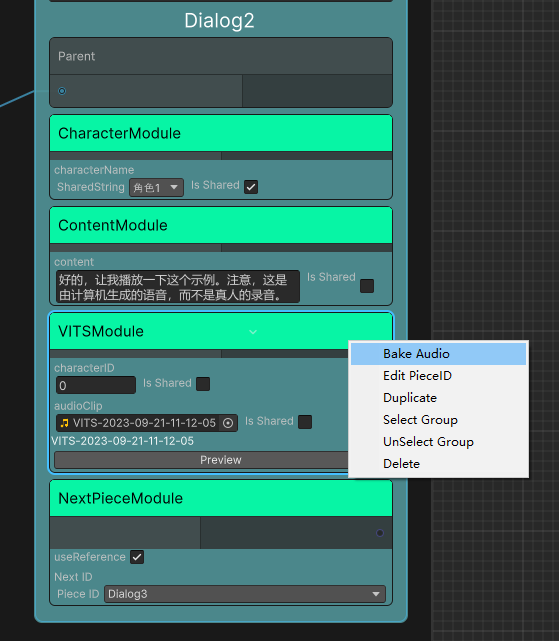

<div align="center">

[](https://deepwiki.com/AkiKurisu/Next-Gen-Dialogue)
[](https://www.zhihu.com/people/akikurisu)
[](https://space.bilibili.com/20472331)

# Next Gen Dialogue

AI powered dialogue visual designer for Unity.



</div>

## Table of Contents

- [Install](#-install)
- [Highlights](#-highlights)
- [Platforms](#platforms)
- [Demo](#demo)
- [Quick Start Guide](#-quick-start-guide)
- [Core Concepts](#core-concepts)
- [Modules](#modules)
- [Extensions](#extensions)
- [Resolvers](#resolvers)
- [Create Dialogue in Script](#create-dialogue-in-script)

## 📦 Install

Add following dependencies to `manifest.json`.

```json
"dependencies": {
    "com.kurisu.chris": "https://github.com/AkiKurisu/Chris.git",
    "com.kurisu.ceres": "https://github.com/AkiKurisu/Ceres.git",
    "com.cysharp.unitask":"https://github.com/Cysharp/UniTask.git?path=src/UniTask/Assets/Plugins/UniTask"
}
```

Then use git URL to download package by Unity Package Manager ```https://github.com/AkiKurisu/Next-Gen-Dialogue.git```.

> **Note**: Experimental features are placed in the `Modules` folder and require installing corresponding dependencies. Check the `README.md` in each module folder for dependencies.

## ✨ Highlights

> **AI powered dialogue visual designer** that combines traditional dialogue design patterns with AIGC to simplify your workflow.

### 🚀 **Core Features**

- **🎨 Visual Dialogue Editor** - Intuitive node-based editor for creating dialogue trees visually
- **🧩 Modular System** - Flexible module system for extending dialogue functionality
- **🤖 AIGC Integration** - AI-powered dialogue generation and baking workflow
- **⚡ Custom Actions** - Seamless integration with Ceres.Flow for custom behaviors
- **🌍 Localization Support** - Built-in support for multi-language dialogue content
- **🎙️ Voice Synthesis** - VITS integration for real-time or baked voice generation

### 🎯 **Key Capabilities**

- **AI Bake Dialogue** - Pre-generate AI dialogue content during design time
- **AI Generate Novel** - Let AI act as copywriter to create dialogue trees
- **Runtime Debugging** - Visual debugging tools to track dialogue execution

## Platforms

Unity 2022.3 LTS or later, compatible with Unity 6.

## Demo

Sample project for Next-Gen Dialogue v2, see [AkiKurisu/Next-Gen-Dialogue-Demo](https://github.com/AkiKurisu/Next-Gen-Dialogue-Demo) for more details.


**Demo Video**: [Bilibili](https://www.bilibili.com/video/BV1hg4y1U7FG)



## 🚀 Quick Start Guide

If you are using this plugin for the first time, it is recommended to play the following example scenes first:

- **`1.Normal Usage.unity`** - Basic usage of `NextGenDialogueComponent` and `NextGenDialogueGraphAsset`
- **`2.Editor Bake Dialogue.unity`** - Sample of baking AI-generated dialogue in Editor
- **`3.Build Dialogue by Code.unity`** - Example of creating dialogue programmatically
- **`4.Bake Novel.unity`** - Example of using ChatGPT to generate dialogue trees infinitely

### Create a Dialogue Graph

`NextGenDialogueComponent` and `NextGenDialogueGraphAsset` are used to store dialogue data. For simplicity, they are collectively referred to as dialogue tree.

Here's a step-by-step guide to create a dialogue tree with a single dialogue and a single option:

1. **Mount Component** - Attach `NextGenDialogueComponent` to any GameObject in your scene
2. **Open Editor** - Click `Open Dialogue Graph` button to enter the visual editor
3. **Create Dialogue Node** - Right-click and create `Container/Dialogue` node (this is the dialogue container)
4. **Connect to Root** - Connect the Parent port of the Dialogue node to the root node
   > You can have multiple dialogues in one dialogue tree, but only those connected to the root node will be used
5. **Create Piece Node** - Create `Container/Piece` node for your first dialogue fragment
6. **Add Content Module** - Right-click Piece node → `Add Module` → `Content Module`, fill in the dialogue content
7. **Create Option Node** - Create `Container/Option` node for dialogue options
8. **Connect Option** - Right-click Piece node → `Add Option`, then connect Piece with Option
9. **⚠️ Important** - At least one Piece node must be added to the Dialogue as the first piece
   - Right-click Dialogue node → `Collect All Pieces` to collect all pieces and adjust their priority
   - For priority details, refer to [Condition Module](#general-modules)

   
  
10. **Save** - Click the `Save` button in the upper left corner of the editor
11. **Test** - Enter Play Mode and click `Play dialogue` on `NextGenDialogueComponent`
12. **Debug** - Click `Open Dialogue Graph` to enter runtime debug mode

   

> 💡 **Tip**: The currently playing dialogue piece will be highlighted in green during runtime debugging

### Add Custom Actions

Next-Gen Dialogue integrates with `Ceres.Flow` to enable custom action features.

Add `ExecuteFlowModule` to any node to fire a flow execution event at runtime.

For more details about `Ceres.Flow`, please refer to [AkiKurisu/Ceres](https://github.com/AkiKurisu/Ceres).



### AI Bake Dialogue

Use AI Dialogue Baker to pre-generate AI dialogue content during design time, improving workflow efficiency without affecting your design framework.



**Steps:**

1. Follow the basic dialogue graph design process from [Create a Dialogue Graph](#create-a-dialogue-graph)
2. Add `AI Bake Module` to fragments or options that need AI generation
3. Select the LLM type you want to use
4. **Select nodes in order** - The recognition order is based on mouse selection order. Finally select the nodes to be baked
5. Preview the input content at the bottom of the editor
6. Click `Bake Dialogue` button on the `AI Bake Module` and wait for AI response
7. After the language model responds, a `Content Module` will be automatically added to store the baked content
8. Continue generating conversations as needed

### AI Generate Novel

Novel mode allows AI to act as a copywriter and planner, providing more precise control over options and fragments compared to direct AI dialogue baking.

Refer to the example scene: `4.Bake Novel.unity`



## Core Concepts

Understanding the fundamental concepts of Next Gen Dialogue will help you get started quickly.

### Node

Next Gen Dialogue uses a node-based visual editor framework. Most features are presented through nodes. The dialogue structure consists of three main node types:

| Name     | Description                                                                            |
| -------- | -------------------------------------------------------------------------------------- |
| Dialogue | Used to define dialogues, such as the first piece of the dialogue and other attributes |
| Piece    | Dialogue piece, usually stores the core dialogue content                               |
| Option   | Dialogue options, usually used for interaction and bridging dialogues                 |

### Module

In addition to nodes, Next Gen Dialogue uses a flexible **Module** system. Modules allow you to extend dialogue functionality, such as:
- Google translation
- Localization
- Custom callbacks
- Conditional logic
- And more...

## Modules 

### General Modules

Built-in general modules for common dialogue functionality:

| Name             | Description                                                                                                                                    |
| -----------------| ---------------------------------------------------------------------------------------------------------------------------------------------- |
| **Content**      | Provide text content for Option or Piece                                                                                                       |
| **TargetID**     | Add jumping target dialogue fragments for Option                                                                                               |
| **PreUpdate**    | Add pre-update behavior for Container, executes when jumping to the Container                                                                 |
| **Callback**     | Add callback behavior for Option, executes after selection                                                                                    |
| **Condition**    | Add conditional logic for Option or Piece. If returns `Status.Failure`, the Container will be discarded. For the first Piece, the system will try the next Piece based on priority |
| **Next Piece**   | Specify the next dialogue segment after the Piece ends. If no option exists, jumps to the specified segment after playing the Piece content   |
| **Google Translate** | Use Google Translate to translate the content of current Option or Piece                                                                  |

### AIGC Modules

Built-in AIGC modules for AI-powered features:

| Name     | Description                                                          |
| -------- | -------------------------------------------------------------------- |
| **Prompt** | Prompt words that provide the basis for subsequent dialogue generation |

### Editor Modules

Editor modules provide useful tools for the editor workflow, such as translation.

#### One-click Translation

Add `Editor/EditorTranslateModule` to the Dialogue node, set the source language (`sourceLanguageCode`) and target language (`targetLanguageCode`), then right-click and select `Translate All Contents` to translate all Pieces and Options with `ContentModule`.



**Custom Module Translation:**

For modules other than `ContentModule`, add `TranslateEntryAttribute` to fields that should be translatable. Then right-click a single node to translate it.

```csharp
public class ExampleModule : CustomModule
{
    // Notify field can be translated
    // Only works for SharedString and string
    [SerializeField, Multiline, TranslateEntry]
    private SharedString value;
}
```

## Extensions

Extensions require installing additional packages or configuring environments before use.

### Localization Extension

Based on [UnityEngine.Localization](https://docs.unity3d.com/Packages/com.unity.localization@1.4/manual/Installation.html) plugin to support dialogue localization.

| Name              | Description                                                              |
| ------------------| ------------------------------------------------------------------------ |
| **Localized Content** | Provide content for Option or Piece after getting text from localization |



### VITS Speech Extension

For VITS local deployment, refer to: [VITS Simple API](https://github.com/Artrajz/vits-simple-api)

> **Note**: Use VITS module with `VITSResolver`. See [Resolvers](#resolvers) section for details.

| Name        | Description                                                                           |
| ----------- | ------------------------------------------------------------------------------------- |
| **VITS Voice**  | Use VITS speech synthesis model to generate voice for Piece or Option in real time |

#### Bake Voice

**Setup:**
1. Install dependencies from `Modules/VITS` (see `Modules/VITS/README.md`)
2. Start the local VITS server
3. Add `AIGC/VITSModule` to nodes where speech needs to be generated
4. Right-click and select `Bake Audio`



**Usage:**
- If satisfied with generated audio, click `Download` to save locally
- Audio files are not retained after exiting editor if not downloaded
- After baking, VITS server is no longer needed at runtime

> ⚠️ **Important**: If `AudioClip` field is empty, runtime generation mode is enabled by default. If there's no connection, dialogue may not proceed. For baking-only usage, keep the `AudioClip` field filled.

## Resolvers

Resolvers detect Modules in Containers at runtime and execute preset logic such as dependency injection and behavior execution.

| Name              | Description                                                              |
| -----------------| ------------------------------------------------------------------------- |
| **Default Resolver** | Basic resolver supporting all built-in common modules                   |
| **VITS Resolver**    | Additionally detects VITS modules to generate voice in real time        |

### How to Switch Resolver

**1. In-Scene Global Resolver**

Mount `VITSSetup` script on any GameObject to enable VITS Resolver globally in the scene.

**2. Dialogue-Specific Resolver**

Add `VITSResolverModule` to the Dialogue node to specify the resolver for that dialogue. You can also click the Settings button in the module and select which Resolvers to replace in `Advanced Settings`.


## Create Dialogue in Script

You can create dialogues programmatically using the scripting API. Here's an example:

```csharp
using UnityEngine;

public class CodeDialogueBuilder : MonoBehaviour
{
    private RuntimeDialogueBuilder _builder;
    
    private void Start()
    {
        PlayDialogue();
    }
    
    private void PlayDialogue()
    {
        var dialogueSystem = DialogueSystem.Get();
        _builder = new RuntimeDialogueBuilder();
        // First Piece
        _builder.AddPiece(GetFirstPiece());
        // Second Piece
        _builder.AddPiece(GetSecondPiece());
        dialogueSystem.StartDialogue(_builder);
    }
    
    private static Piece GetFirstPiece()
    {
        var piece = Piece.GetPooled();
        piece.AddContent("This is the first dialogue piece");
        piece.ID = "01";
        piece.AddOption(new Option
        {
            Content = "Jump to Next",
            TargetID = "02"
        });
        return piece;
    }
    
    private static Piece GetSecondPiece()
    {
        var piece = Piece.GetPooled();
        piece.AddContent("This is the second dialogue piece");
        piece.ID = "02";
        piece.AddOption(GetFirstOption());
        piece.AddOption(GetSecondOption());
        return piece;
    }
    
    private static Option GetFirstOption()
    {
        var callBackOption = Option.GetPooled();
        // Add CallBack Module
        callBackOption.AddModule(new CallBackModule(() => Debug.Log("Hello World!")));
        callBackOption.Content = "Log";
        return callBackOption;
    }
    
    private static Option GetSecondOption()
    {
        var option = Option.GetPooled();
        option.Content = "Back To First";
        option.TargetID = "01";
        return option;
    }
}
```

## License

MIT