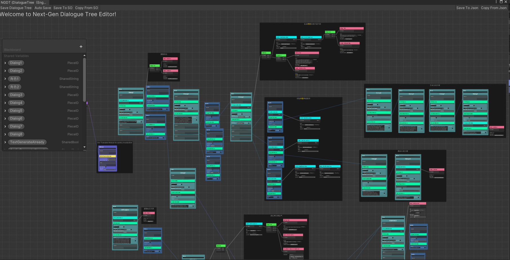

# Next Gen Dialogue User Manual


***Read this document in Chinese: [中文文档](./README_ZH.md)***

## Content

  - [Features](#features)
  - [RoadMap](#roadmap)
  - [Supported version](#supported-version)
  - [Install](#install)
  - [Quick Start](#quick-start)
    - [Create a Dialogue Tree](#create-a-dialogue-tree)
    - [AI Generate Dialogue](#ai-generate-dialogue)
    - [AI Bake Dialogue](#ai-bake-dialogue)
  - [Nodes](#nodes)
  - [Modules](#modules)
    - [General Modules](#general-modules)
    - [AIGC Modules](#aigc-modules)
    - [Experimental Modules](#experimental-modules)
      - [Localization Extension](#localization-extension)
      - [VITS Speech Extension](#vits-speech-extension)
      - [Transformer Extension](#transformer-extension)
  - [Experimental Function Introduction](#experimental-function-introduction)
    - [One-click Translation](#one-click-translation)
    - [Bake Voice](#bake-voice)
  - [Resolvers](#resolvers)
    - [How to Switch Resolver](#how-to-switch-resolver)
  - [Create Dialogue by Code](#create-dialogue-by-code)


## Features


Next Gen Dialogue plugin (hereinafter referred to as NGD) is a Unity dialogue plugin combined with large language model design, won the Unity AI Plugin Excellence Award from Unity China. It combines the traditional dialogue design method with AI technique (eg. Large Language Model(`LLM`), Conditional Variational Autoencoder with Adversarial Learning for End-to-End Text-to-Speech(``VITS``)), also it has some experiential features powered by `Unity Sentis`. Currently this package is an experimental attempt and hopes you enjoy it. 

It has the following features:
1. Visual dialogue editor
2. Modular dialogue function
3. Support AIGC to generate dialogue when running
4. Support AIGC baking dialogue in Editor
5. Debug during runtime
   
Demo project: https://github.com/AkiKurisu/Next-Gen-Dialogue-Example-Project




## RoadMap

1. Use Unity Sentis to inference VITS, LLM model instead of using Python API which needs network and server.

## Supported version

* Unity 2021.3 or Later

## Install

Using git URL to download package by Unity PackageManager ```https://github.com/AkiKurisu/Next-Gen-Dialogue.git```

The experimental features of Next Gen Dialogue are placed in the Modules folder and will not be enabled without installing the corresponding dependencies. You can view the dependencies in the `README.md` document under its folder.

To use core functions, you need to install `Newtonsoft Json` in PackageManager.

## Quick Start

If you are using this plugin for the first time, it is recommended to play the following example scenes first:

`` 1.Normal Usage.unity `` this scene contains the use of NextGenDialogueTree and NextGenDialogueTreeSO;

`` 2.GPT Generate dialogue.unity`` this scene contains the samples of dialogue content using ChatGPT during runtime;

`` 3.Local LLM Generate dialogue.unity `` this scene contains a sample of dialogue with the use of local large language models at runtime;

`` 4. Editor Bake Dialogue.unity``this scene contains the sample of baking conversation conversation in the use of AI dialogue Baker in Editor;

```5.Build Dialogue by Code.unity``` this scene contains the use of Code to generate dialogue.

``6.Bake Novel.unity`` An example of using ChatGPT to infinitely generate dialogue trees.

### Create a Dialogue Tree

NextGenDialogueTree and NextGenDialogueTreeSO are used to store dialogue data. In order to facilitate understanding, it is collectively referred to as dialogue tree.
The following process is to create a dialogue tree that contains only a single dialogue and a single option:

1. Mount NextGenDialogueTree on any gameObject
2. Click ``Edit DialogueTree`` to enter the editor
3. Create the Container/dialogue node, the node is the dialogue container used in the game
4. Connect the Parent port of the dialogue Node to the root node. You can have multiple dialogue in one dialogueTree, but only those connected to the root node will be used.
5. Create the Container/Piece node and create our first dialogue fragment
6. Right -click Piece node ``Add Module`` add ``Content Module``, you can fill in the contents of the conversation in ``Content``
7. Create a Container/Option node and create a dialogue option corresponding to the PIECE node
8. Right-click Piece node ``Add Option``, connect Piece with Option
9. <b style = "color:#ee819e"> Very important: </b> At least one Piece node needs to be added to the Dialogue as the first piece of the dialogue.You can right -click dialogue's ``Add Piece `` to connect with the connection or quoting its PieceID. You can also right -click dialogue's ``Collect All Pieces`` to add all the piece in Graph to the dialogue and adjust the priority of the Piece
    * For priority, please refer to [《General Module-Condition Module》](#general-modules)

    
  
10. Click on the upper left of the editor's `` Save`` to save dialogue
11. Click Play to enter PlayMode
12. Click on NextGenDialogueTree ``Play dialogue`` to play conversation
13. Click `` Debug DialogueTree `` to enter the debug mode
    


- <span style = "color:#f8d09d"> Tips: </span> The currently played dialogue piece will be displayed in green

### AI Generate Dialogue

The traditional dialogue design is completely dependent on the designer. If you want to make the dialogue more personalized, you can try to use AIGC. In addition to ChatGPT, you can also use a large language model deployed locally. Of course, since the model depends on the Python environment, Using the model in Unity needs to rely on the terminal for network communication

<span style="color:#F8D09D">Tips: </span> Currently supports the following popular terminals, you can choose according to your needs and equipment conditions
1. The Generate mode of [KoboldAI-KoboldCPP](https://github.com/LostRuins/koboldcpp), KoboldCPP supports CPU reasoning
2. The Generate mode of [Oobabooga-Text-Generation-WebUI](https://github.com/oobabooga/text-generation-webui), WebUI has a high memory usage rate, and running Unity on the same machine will affect performance
3. API (Generate mode) and OpenAI Type API (Chat mode) of [ChatGLM2-6B](https://github.com/THUDM/ChatGLM2-6B), ChatGLM is a powerful and efficient Chinese-English language model

The following process is to create a dialogue tree that can generate dialogue content according to the player's choice at runtime:

1. The design of the basic dialogue tree is consistent with the process of [《Create a Dialogue Tree》](#create-a-dialogue-tree)
2. AIGC can better generate the content required by users by providing a prompt word (Prompt). For example, the background setting of the dialogue and the additional requirements of the designer. You only need to add ```Prompt Module``` in the dialogue node, and fill in the prompt word in ```prompt```
3. For Piece or Option nodes that require AI recognition but do not need to be generated, add ```Character Module``` and indicate the name of the speaking character in ```characterName```
4. Add ```AI Generate Module``` to the Piece node that needs to be generated by AI and fill in the corresponding character name in ```characterName```
5. Create an empty GameObject in the scene and mount the ``AIEntry`` component
6. Select the type of LLM you are using and configure the address and port of the Server

- <span style="color:#F8D09D">Note</span> : Generate dialogue content does not support generate option at runtime

### AI Bake Dialogue

It is not easy to control the dialogue content of AIGC at runtime, but you can use AI dialogue Baker to bake the dialogue content generated by AI in advance when designing the dialogue tree, so as to improve the workflow efficiency without affecting your design framework.


1. The basic dialogue tree design is consistent with the process of [《Create a Dialogue Tree》](#create-a-dialogue-tree)
2. The addition of Prompt is consistent with the process of [《AI Generated Dialogue》](#ai-generate-dialogue)
3. Add ```AI Bake Module``` for the fragments or options that need to be baked, and remove the module for nodes that do not need to be baked
4. Select the type of LLM you are baking with
5. <b>Select in turn</b> the nodes that AI dialogue Baker needs to recognize, the order of recognition is based on the order selected by the mouse, and finally select the nodes that need to be baked
6. If the selection is successful, you can see the preview input content at the bottom of the editor
7. Click the ````Bake Dialogue`` button on the ````AI Bake Module```` and wait for the AI response
8. After the language model responds, a ```Content Module``` will be automatically added to the node to store the baked dialogue content
9. You can continuously generate conversations based on your needs

### AI generated novel

Different from talking directly to AI in baking dialogue, novel mode allows AI to play the role of copywriter and planner to write dialogue, so it can control options and fragments more precisely. Please refer to the example: ``6.Bake Novel.unity``


## Nodes

NGD use node based visual editor framework, most of the features are presented through nodes.

The construction dialogue are divided into the following parts in NGD:
  
| Name     | Description                                                                            |
| -------- | -------------------------------------------------------------------------------------- |
| Dialogue | Used to define dialogues, such as the first piece of the dialogue and other attributes |
| Piece    | dialogue piece, usually store the core dialogue content                                |
| Option   | dialogue options, usually used for interaction and bridging dialogues                  |

In addition, in order to add interest to the dialogue such as adding events and executing actions, you can use the following types of nodes in the behavior tree framework in NGD:

| Name        | Description                                                                                                                         |
| ----------- | ----------------------------------------------------------------------------------------------------------------------------------- |
| Composite   | It has one or more child nodes and controls which child nodes are updated.                                                          |
| Action      | This is a leaf node. It performs actions such as following the player, attacking, fleeing or other actions you define.              |
| Conditional | It has a child node and checks if the child node is updatable. When there is no child node, Conditional is a leaf node like Action. |
| Decorator   | It has a child node, which will modify the return value according to the return value of the child node                             |

## Modules

In addition to the above nodes, a more flexible concept is used in NGD, that is, Module. You can use Module to change the output form of the dialogue, such as Google translation, localization, add callbacks, or be executed as a markup. 

### General Modules

The following are built-in general modules:

| Name                    | Description                                                                                                                                                                                                                                                                                                                            |
| ----------------------- | -------------------------------------------------------------------------------------------------------------------------------------------------------------------------------------------------------------------------------------------------------------------------------------------------------------------------------------- |
| Content Module          | Provide text content for Option or Piece                                                                                                                                                                                                                                                                                               |
| TargetID Module         | Add jumping target dialogue fragments for Option                                                                                                                                                                                                                                                                                       |
| PreUpdate Module        | Add pre-update behavior for Container, it will update when jumping to the Container                                                                                                                                                                                                                                                    |
| CallBack Module         | Add callback behavior for Option, they will be updated after selection                                                                                                                                                                                                                                                                 |
| ScriptableEvent Module  | Adds ``ScriptableEvent`` events to Option, they will be updated after selection, ``ScriptableEvent`` can be used for cross-scenario event subscription                                                                                                                                                                                 |
| UnityEvent Module       | Add ``UnityEvent`` events to Option, they will be updated after selection, ``UnityEvent`` can be used for event subscription in traditional single scene                                                                                                                                                                               |
| Condition Module        | Add judgment behavior for Option or Piece, it will be updated when jumping to the Container, if the return value is ``Status.Failure``, the Container will be discarded. If it is the first Piece of the dialogue, the system will try to jump to the next Piece according to the order in which the Pieces are placed in the dialogue |
| NextPiece Module        | Add the next dialogue segment after the end of the Piece. If there is no option, it will jump to the specified dialogue segment after playing the content of the Piece                                                                                                                                                                 |
| Google Translate Module | Use Google Translate to translate the content of current Option or Piece                                                                                                                                                                                                                                                               |

### AIGC Modules

The following are the built-in AIGC modules:

| Name                             | Description                                                                  |
| -------------------------------- | ---------------------------------------------------------------------------- |
| Prompt Module                    | Prompt words that provide the basis for subsequent dialogue generation       |
| Character Module                 | Annotate the Speaker of a dialogue                                           |
| AI Generate Module               | Allow Piece to generate dialogue using AIGC based on previous player choices |
| AI Bake Module ``(Editor Only)`` | Add this module to bake Option or Piece in ``Editor``                        |

### Experimental Modules

The following are experimental modules, you need to install the corresponding Package or configure the corresponding environment before use:

#### Localization Extension

   Based on the [UnityEngine.Localization](https://docs.unity3d.com/Packages/com.unity.localization@1.4/manual/Installation.html) plugin to support the localization of dialogue

| Name                     | Description                                                              |
| ------------------------ | ------------------------------------------------------------------------ |
| Localized Content Module | Provide content for Option or Piece after getting text from localization |

#### VITS Speech Extension

For VITS local deployment, please refer to this repository: [VITS Simple API](https://github.com/Artrajz/vits-simple-api)

If you want to use the VITS module, please use it with VITSAIReResolver. For the use of the Resolver, please refer to the following [《Resolver》](#Resolver)

| Name        | Description                                                                           |
| ----------- | ------------------------------------------------------------------------------------- |
| VITS Module | Use VITS speech synthesis model to generate language for Piece or Option in real time |

#### Transformer Extension

Based on great work from [HuggingFace](https://thomassimonini.substack.com/p/create-an-ai-robot-npc-using-hugging?r=dq5fg&utm_campaign=post&utm_medium=web) and [Unity Sentis](https://discussions.unity.com/t/about-sentis-beta/260899).

You can use bert transformer model in runtime to search dialogue piece instead of connecting manually.

| Name                             | Description                                                                   |
| -------------------------------- | ----------------------------------------------------------------------------- |
| Sentence Similarity Entry Module | Entry point to collect sentence data                                          |
| Inference Similar ID Module      | Used to inference option's target dialogue piece id using Sentence Similarity |

## Experimental Function Introduction

### One-click Translation

Add Editor/EditorTranslateModule in the Dialogue node, set the source language (`sourceLanguageCode`) and target language (`targetLanguageCode`) of the translation, right-click and select `Translate All Contents` to perform all Piece and Option with `ContentModule` translate.


For nodes other than `ContentModule`, if the `TranslateEntryAttribute` is added to the field, you can right-click a single node to translate it.

```c#
namespace Kurisu.NGDT.Behavior
{
    public class SetString : Action
    {
      //Notify field can be translated
      //* Only work for SharedString and string
      [SerializeField, Multiline, TranslateEntry]
      private SharedString value;
    }
}
```


### Bake Voice

Before use, you need to install the corresponding dependencies of `Modules/VITS` and open the local VITS server (refer to `Modules/VITS/README.md`). Add `AIGC/VITSModule` to the node where speech needs to be generated, right-click and select ``Bake Audio ``


If you are satisfied with the generated audio, click `Download` to save it locally to complete the baking, otherwise the audio file will not be retained after exiting the editor.

It is no longer necessary to start the VITS server at runtime after baking is complete.

* If the AudioClip field is empty, the run generation mode is enabled by default. If there is no connection, the conversation may not proceed. If you only need to use the baking function, please keep the AudioClip field not empty at all times.

## Resolvers
Resolver is used to detect the Module in the Container at runtime and execute a series of preset logic such as injecting dependencies and executing behaviors, the difference between NGD's built-in Resolver is as follows:

| Name                                  | Description                                                                                                         |
| ------------------------------------- | ------------------------------------------------------------------------------------------------------------------- |
| BuiltIn Resolver                      | The most basic resolver, supporting all built-in common modules                                                     |
| AI Resolver                           | Added AIGC module on the basis of BuiltIn Resolver                                                                  |
| VITS AI Resolver ```(Experimental)``` | On the basis of AI Resolver, additionally detect VITS modules to generate voice in real time, no need for bake mode |

### How to Switch Resolver

1. In-scene Global Resolver
    You can mount the ```AIEntry``` script on any GameObject to enable AIResolver in the scene

2. Dialogue specified Resolver
   
    You can add ``AIResolverModule`` (or  ```VITSAIResolverModule```) to the dialogue node to specify the resolver used by the dialogue, and you can also click the Setting button in the upper right corner of the module and select which Resolvers to be replaced in ``Advanced Settings``

## Create Dialogue by Code

NGD is divided into two parts, DialogueSystem (NGDS) and DialogueTree (NGDT). The former defines the data structure of the dialogue, which is interpreted by Resolver after receiving the data. The latter provides a visual editing solution and inherits the interface from the former. So you can also use scripts to write dialogues, examples are as follows:

```C#
using UnityEngine;
public class CodeDialogueBuilder : MonoBehaviour
{
    private DialogueGenerator generator;
    private IEnumerator Start()
    {
        yield return new WaitForEndOfFrame();
        PlayDialogue();
    }
    private void PlayDialogue()
    {
        var dialogueSystem = IOCContainer.Resolve<IDialogueSystem>();
        generator = new();
        //First Piece
        var piece = DialoguePiece.CreatePiece();
        piece.Content = "This is the first dialogue piece";
        piece.PieceID = "01";
        piece.AddOption(new DialogueOption()
        {
            Content = "Jump to Next",
            TargetID = "02"
        });
        generator.AddPiece(piece);
        //Second Piece
        piece = DialoguePiece.CreatePiece();
        piece.Content = "This is the second dialogue piece";
        piece.PieceID = "02";
        var callBackOption = DialogueOption.CreateOption();
        //Add CallBack Module
        callBackOption.AddModule(new CallBackModule(() => Debug.Log("Hello World !")));
        callBackOption.Content = "Log";
        piece.AddOption(callBackOption);
        generator.AddPiece(piece);
        dialogueSystem.StartDialogue(generator);
    }
}
```