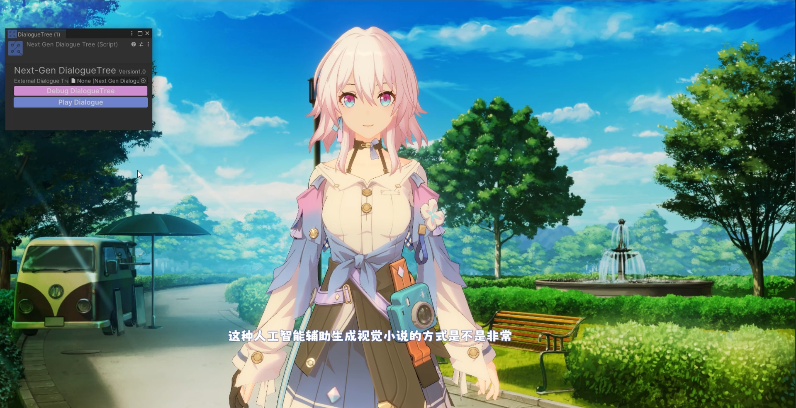
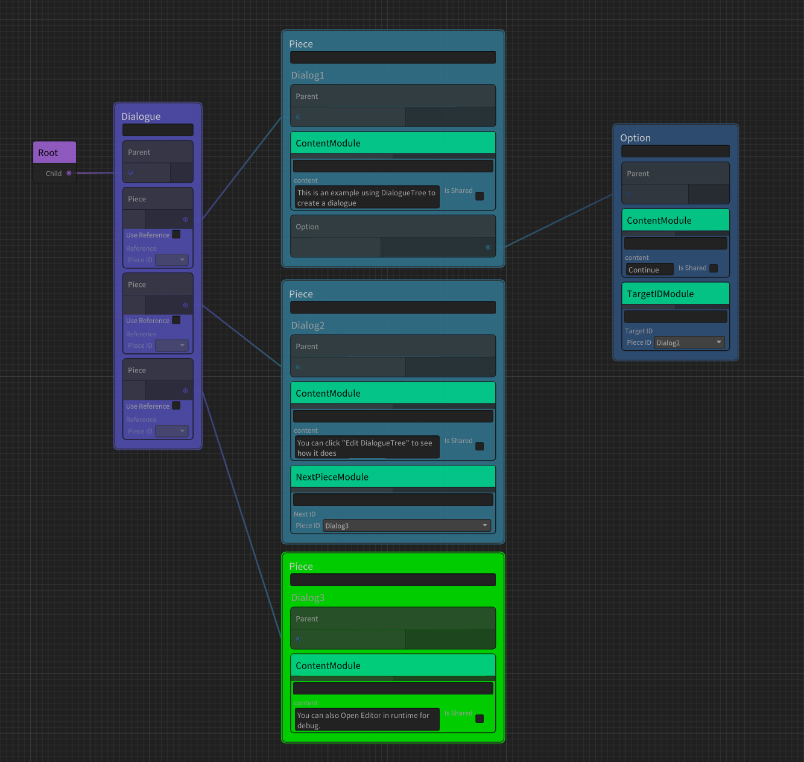
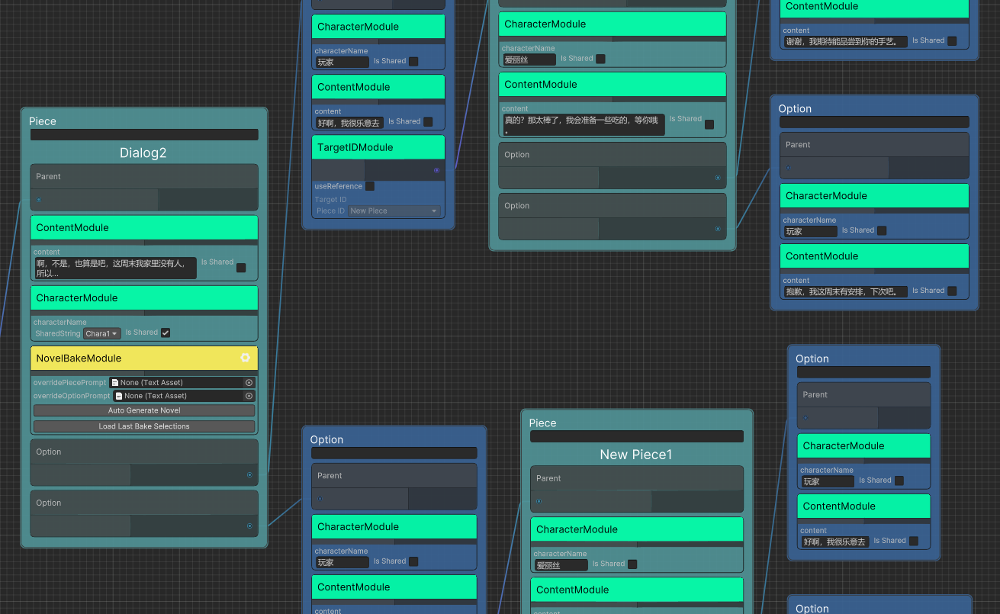
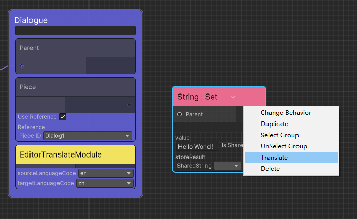
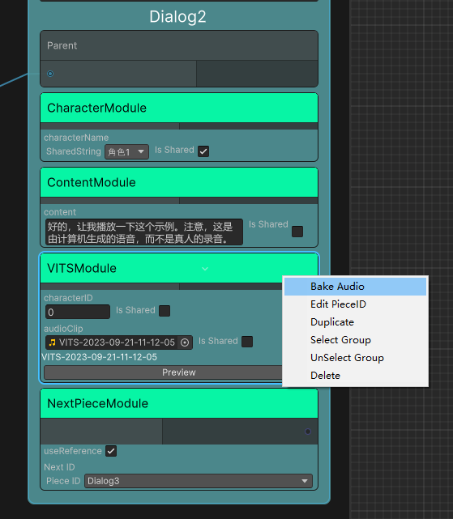

# Next Gen Dialogue 用户手册


***Read this document in English: [English Document](./README.md)***

## 目录

  - [特点](#特点)
  - [路线图](#路线图)
  - [支持的版本](#支持的版本)
  - [安装](#安装)
  - [快速开始](#快速开始)
    - [创建对话树](#创建对话树)
    - [AI生成对话](#ai生成对话)
    - [AI烘焙对话](#ai烘焙对话)
  - [结点](#结点)
  - [模组](#模组)
    - [通用模组](#通用模组)
    - [AIGC模组](#aigc模组)
    - [实验性模组](#实验性模组)
      - [Localization 本地化拓展](#localization-本地化拓展)
      - [VITS 语音合成拓展](#vits-语音合成拓展)
  - [编辑器功能介绍](#编辑器功能介绍)
    - [一键翻译](#一键翻译)
    - [烘焙语音](#烘焙语音)
  - [解析器](#解析器)
    - [如何切换解析器](#如何切换解析器)
  - [使用脚本编写对话](#使用脚本编写对话)


## 特点


Next Gen Dialogue插件（以下简称NGD）是一款结合大语言模型设计的Unity对话插件，荣获Unity中国颁发的Unity AI插件优秀奖。 它将传统的对话设计方法与人工智能技术相结合。 目前这个包是一个实验性的尝试，希望你喜欢。

具有以下特点：
1. 可视化的对话编辑器
2. 模块化的对话功能
3. 支持AIGC运行时生成对话
4. 支持AIGC在Editor中烘焙对话
5. 运行时Debug

演示项目: https://github.com/AkiKurisu/Next-Gen-Dialogue-Example-Project


演示视频: https://www.bilibili.com/video/BV1hg4y1U7FG



## 路线图

1. 使用Unity Sentis推理VITS、LLM模型，而不是使用需要网络和服务器的Python API (目前存在技术限制)。 

## 支持的版本

* Unity 2021.3 or later


## 安装

在Unity PackageManager中使用Git URL下载 ```https://github.com/AkiKurisu/Next-Gen-Dialogue.git```

Next Gen Dialogue的实验特性放入了Modules文件夹中，再没有安装相应依赖的情况下不会被启用，你可以在其文件夹下的`README.md`文档中查看依赖项。

使用核心功能需在PackageManager中安装`Newtonsoft Json`。

## 快速开始

如果您是第一次使用该插件，推荐先游玩以下示例场景：

``1.Normal Usage.unity`` 场景包含了使用NextGenDialogueTree和NextGenDialogueTreeSO的样例；

``2.GPT Generate Dialogue.unity`` 场景包含了运行时使用ChatGPT生成对话内容的样例；

``3.Local LLM Generate Dialogue.unity`` 场景包含了运行时使用本地大语言模型的生成对话样例；

``4.Editor Bake Dialogue.unity`` 场景包含了在Editor中使用AI Dialogue Baker烘焙对话内容的样例；

``5.Build Dialogue by Code.unity`` 场景包含了使用Code生成对话的样例。

``6.Bake Novel.unity`` 使用ChatGPT无限生成对话树的样例。

### 创建对话树

NextGenDialogueTree和NextGenDialogueTreeSO用于存储对话数据，为了便于理解之后统称为对话树（DialogueTree）。
以下流程是创建一个仅包含单个对话片段和单个选项的对话树：

1. 在任意GameObject上挂载NextGenDialogueTree
2. 点击```Edit DialogueTree```进入编辑器
3. 创建Container/Dialogue结点，该结点是游戏时所使用的对话容器
4. 将Dialogue结点的Parent端口与Root结点相连接，你可以在一个DialogueTree中拥有多个Dialogue，但只有连接Root结点的才会被使用
5. 创建Container/Piece结点，创建我们第一个对话片段
6. 右键Piece结点``Add Module``添加``Content Module``模块，你可以在``content``中填写对话的内容
7. 创建Container/Option结点，创建该Piece结点对应的对话选项
8. 右键Piece结点``Add Option``，将Piece与Option相连
9. <b style="color:#EE819E">非常重要:</b> 至少需要将一个Piece结点加入Dialogue中作为对话的首个片段。你可以右键Dialogue的``Add Piece``通过连线或引用其PieceID进行关联，也可以右键Dialogue的``Collect All Pieces``将Graph中所有的Piece加入Dialogue中，并且通过排序来调整Piece的优先级
    * 优先级请参考[通用模组-Condition Module](#通用模组)

    
  
1.  点击编辑器左上方的```Save```保存对话
2.  点击Play进入PlayMode
3.  点击NextGenDialogueTree的```Play Dialogue```播放对话
4.  点击``Debug DialogueTree``进入Debug模式
    


- <span style="color:#F8D09D">Tips : </span>当前正在播放的对话片段将以绿色进行显示

### AI生成对话

传统的对话设计完全依赖于设计者，如果您希望让对话更加个性化，可以尝试使用AIGC的方式，除了ChatGPT之外，您还可以使用本地部署的大语言模型，当然由于模型依赖于Python环境，在Unity中使用模型需要依赖终端进行网络通信

<span style="color:#F8D09D">Tips : </span>目前支持以下热门的终端，你可以根据需求和设备条件选择
1. [KoboldAI-KoboldCPP](https://github.com/LostRuins/koboldcpp)的Generate模式，KoboldCPP支持使用CPU推理
2. [Oobabooga-Text-Generation-WebUI](https://github.com/oobabooga/text-generation-webui)的Generate模式，WebUI显存占用率较高，同机器运行Unity将影响性能
3. [ChatGLM2-6B](https://github.com/THUDM/ChatGLM2-6B)的API(Generate模式)和OpenAI Type API(Chat模式)，ChatGLM是强大、高效的中英大语言模型

以下流程是创建一个运行时可以根据玩家选择生成对话内容的对话树：

1. 基础对话树设计与《[创建对话树](<#创建对话树>)》的流程一致 
2. AIGC可以通过提供一段提示词（Prompt）来更好的生成用户所需的内容。例如对话的背景设定，设计者的额外需求。你只需要在Dialogue结点中添加```Prompt Module```，将提示词填入```prompt```中即可
3. 对于需要AI识别但不需要生成的Piece或Option结点，添加```Character Module```并在```characterName```中注明说话的角色名称
4. 对于需要AI生成的Piece结点添加```AI Generate Module```并在```characterName```中填写对应的角色名称
5. 在场景中创建空GameObject，挂载``AIEntry``组件
6. 选择您使用的LLM类型并配置Server的地址和端口

- <span style="color:#F8D09D">注意</span>：运行时生成对话暂不支持生成选项

### AI烘焙对话

在运行时完全使用AIGC的对话内容不易控制，但您可以使用AI Dialogue Baker在设计对话树时提前烘焙AI生成的对话内容，从而在不影响您的设计框架的同时提高工作流效率。


1. 基础对话树设计与《[创建对话树](#创建对话树)》的流程一致 
2. Prompt添加与《[AI生成对话](#AI生成对话)》的流程一致 
3. 为需要烘焙的片段或选项添加```AI Bake Module```, 不需要烘焙的结点请移除该模组
4. 选择您烘焙时使用的LLM类型
5. <b>依次选择</b>AI Dialogue Baker需要识别的结点，识别的顺序以鼠标选中的顺序为准，最后选中需要烘焙的结点
6. 如果选择成功，你可以在编辑器的底部看到预览的输入内容
7. 点击```AI Bake Module```上的```Bake Dialogue```按钮等待AI响应
8. 语言模型响应后，将自动在该结点中添加```Content Module```存放烘焙出的对话内容
9. 你可以根据需求连续生成对话

### AI生成小说

和烘焙对话中直接和AI对话不同，小说模式让AI扮演文案策划编写对话，因此可以对选项和片段的控制更加精确，请参考示例：``6.Bake Novel.unity`` 



## 结点

NGD使用基于节点的可视化编辑器框架，大部分功能都是通过节点呈现的。

构建对话在NGD中它们被分为以下几部分：
  
| 名称     | 说明                                   |
| -------- | -------------------------------------- |
| Dialogue | 用于定义对话，例如对话的首个片段等属性 |
| Piece    | 对话片段，通常存放核心的对话内容       |
| Option   | 对话选项，通常用于交互和衔接对话       |

除此之外，为了给对话增加趣味性例如增加事件、执行行为，在NGD中你可以使用行为树框架中的以下类型结点：

| 名称        | 描述                                                                                     |
| ----------- | ---------------------------------------------------------------------------------------- |
| Composite   | 它有一个或多个子结点并控制要更新哪个子结点。                                             |
| Action      | 这是叶结点。 它执行诸如跟随玩家、攻击、逃跑或您定义的其他动作。                          |
| Conditional | 它有一个子结点，检查子结点是否可更新。 当没有子结点时，Conditional与Action一样是叶结点。 |
| Decorator   | 它有一个子结点，会根据子结点的返回值修改返回值                                           |

## 模组

除了上述结点，在NGD中还使用了一个更灵活的概念即模组Module，你可以使用Module改变对话的输出形式例如Google翻译、本地化，增加回调或是作为一个标记。

### 通用模组

以下是内置的通用模组：

| 名称                    | 描述                                                                                                                                                                                                 |
| ----------------------- | ---------------------------------------------------------------------------------------------------------------------------------------------------------------------------------------------------- |
| Content Module          | 为Option或Piece提供文本内容                                                                                                                                                                          |
| TargetID Module         | 为Option增加跳转的目标对话片段                                                                                                                                                                       |
| PreUpdate Module        | 为Container增加预更新行为，它会在跳转到该Container时进行更新                                                                                                                                         |
| CallBack Module         | 为Option增加回调行为，它们将在选择后进行更新                                                                                                                                                         |
| ScriptableEvent Module  | 为Option增加``ScriptableEvent``事件，它们将在选择后进行更新,``ScriptableEvent ``可用于跨场景事件订阅                                                                                                 |
| UnityEvent Module       | 为Option增加``UnityEvent``事件，它们将在选择后进行更新,``UnityEvent``可用于传统单场景内事件订阅                                                                                                      |
| Condition Module        | 为Option或Piece增加判断行为，它会在跳转到该Container时进行更新，如果返回值为``Status.Failure``则该Container被丢弃。如果是对话的首个Piece，则系统会按照Dialogue中Piece的放置顺序尝试跳转至下一个Piece |
| NextPiece Module        | 为Piece增加结束后的下一个对话片段，如果没有选项，则会在播放完Piece内容后跳转至指定对话片段                                                                                                           |
| Google Translate Module | 使用谷歌翻译对当前Option或Piece的内容进行翻译                                                                                                                                                        |

### AIGC模组

以下是内置的AIGC模组：

| 名称                             | 描述                                            |
| -------------------------------- | ----------------------------------------------- |
| Prompt Module                    | 为之后生成的对话生成提供基础的提示词            |
| Character Module                 | 标注对话的说话者                                |
| AI Generate Module               | 让Piece根据之前玩家的选择使用AIGC的方式生成对话 |
| AI Bake Module ``(Editor Only)`` | 添加此模组用以在``Editor``中烘焙Option或Piece   |

### 实验性模组

以下是实验性的模组, 使用前需要安装相应的Package或配置对应环境：

#### Localization 本地化拓展

  基于[UnityEngine.Localization](https://docs.unity3d.com/Packages/com.unity.localization@1.4/manual/Installation.html)插件支持对话的本地化

| 名称                     | 描述                                      |
| ------------------------ | ----------------------------------------- |
| Localized Content Module | 从本地化获取文本后为Option或Piece提供内容 |

#### VITS 语音合成拓展

VITS本地部署请参考该仓库：[VITS Simple API](https://github.com/Artrajz/vits-simple-api)

如要使用VITS模组请配合VITSAIResolver使用，Resolver解析器使用请参考下文的[《解析器》](#解析器)

| 名称        | 描述                                            |
| ----------- | ----------------------------------------------- |
| VITS Module | 使用VITS语音合成模型为Piece或Option实时生成语言 |

## 编辑器功能介绍

### 一键翻译

在Dialogue结点中添加Editor/EditorTranslateModule，设置翻译的来源语言（`sourceLanguageCode`）和目标语言（`targetLanguageCode`）, 右键选择`Translate All Contents`对所有带有``ContentModule``的Piece和Option进行翻译。


对于非`ContentModule`的结点，如字段添加了`TranslateEntryAttribute`可以右键单个结点进行翻译

```c#
namespace Kurisu.NGDT.Behavior
{
    public class SetString : Action
    {
      //Notify field can be translated
      //* Only work for SharedString and string
      [SerializeField, Multiline, TranslateEntry]
      private SharedString value;
    }
}
```


### 烘焙语音

使用前需要安装`Modules/VITS`相应依赖并开启本地VITS服务器（参照`Modules/VITS/README.md`），在需要生成语音的结点中添加`AIGC/VITSModule`，右键选择``Bake Audio``



如你对生成的音频较为满意，点击`Download`保存到本地从而完成烘焙，否则退出编辑器后不会保留音频文件。

烘焙完成后不再需要运行时启动VITS服务器。

* 如果AudioClip字段为空，则默认开启运行生成模式，如没有连接可能导致对话无法进行，如只需要使用烘焙功能请将AudioClip字段始终保持不为空。

## 解析器
解析器Resolver用以在运行时检测Container中的Module并执行一系列预设的逻辑例如注入依赖、执行行为
，NGD内置的Resolver区别如下：

| 名称                                  | 描述                                          |
| ------------------------------------- | --------------------------------------------- |
| BuiltIn Resolver                      | 基础的解析器，支持所有内置的通用模组          |
| AI Resolver                           | BuiltIn Resolver 基础上增加了AIGC模组         |
| VITS AI Resolver ```(Experimental)``` | AI Resolver基础上额外检测VITS模组实时生成语音 |

### 如何切换解析器

1. 场景内全局解析器
   你可以在任意GameObject上挂载```AIEntry```脚本来在该场景启用AIResolver

2. 对话指定解析器
   
   你可以在对话的Dialogue结点上添加``AIResolverModule``(或```VITSAIResolverModule```)来指定该对话使用的解析器，你还可以点击该模组的右上角Setting按钮，在``Advanced Settings``中选择替换的Resolver

## 使用脚本编写对话

在NGD中分为了两个部分DialogueSystem和DialogueTree，前者定义了对话的数据结构，接收数据后由Resolver进行解释，后者提供了可视化的编辑方案，并继承自前者的接口。因此你也可以使用脚本的来编写对话，样例如下：

```C#
using UnityEngine;
public class CodeDialogueBuilder : MonoBehaviour
{
    private DialogueGenerator generator;
    private IEnumerator Start()
    {
        yield return new WaitForEndOfFrame();
        PlayDialogue();
    }
    private void PlayDialogue()
    {
        var dialogueSystem = IOCContainer.Resolve<IDialogueSystem>();
        generator = new();
        //First Piece
        var piece = DialoguePiece.CreatePiece();
        piece.Content = "This is the first dialogue piece";
        piece.PieceID = "01";
        piece.AddOption(new DialogueOption()
        {
            Content = "Jump to Next",
            TargetID = "02"
        });
        generator.AddPiece(piece);
        //Second Piece
        piece = DialoguePiece.CreatePiece();
        piece.Content = "This is the second dialogue piece";
        piece.PieceID = "02";
        var callBackOption = DialogueOption.CreateOption();
        //Add CallBack Module
        callBackOption.AddModule(new CallBackModule(() => Debug.Log("Hello World !")));
        callBackOption.Content = "Log";
        piece.AddOption(callBackOption);
        generator.AddPiece(piece);
        dialogueSystem.StartDialogue(generator);
    }
}
```